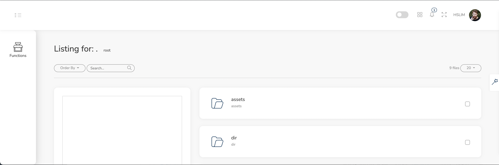
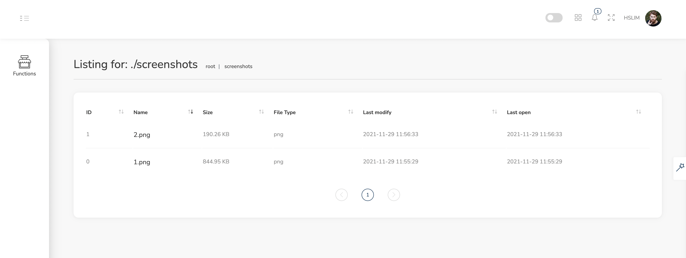
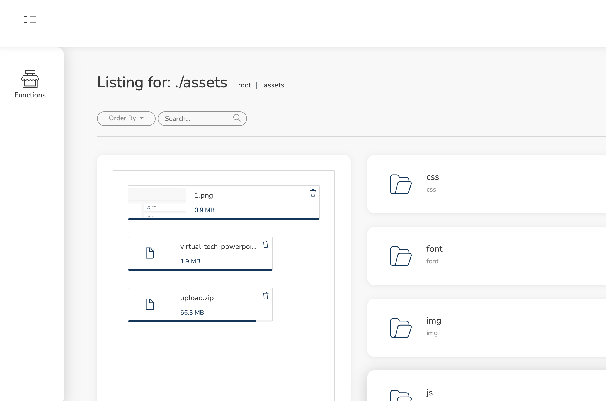

# PHP Directory Listing with upload
## Description
This script is based on PHP, which can list files and directory in your server. It helps expose to download.
It does also support upload with DropzoneJS.
## Features
1. List files and folders in 2 views: Default and DataTable
2. Drag and drop Upload: DropzoneJS with progress
3. API for listing directory
4. Based on Dore theme template
5. Search for file (partly working)

## Plan
> 29/11/2021

- [x] Configurable options
- [x] Exclude some file
- [ ] Optimize and clean code
- [x] Page view
- [ ] Dive in folders without reload
- [ ] Preview files
- [ ] Admin panel (delete, copy, move, etc)
- [ ] Single File version
- [ ] Lite version

> 30/11/2021
- [ ] Upload to current folder
 
## Screenshots

*File listing*

*Table view*

*File uploading*
## Demo:
[You can checkout the demo here](https://nl.vslim.io)
## Credits:
- ColoredStrategies/Dore jQuery
- halgatewood / file-directory-list